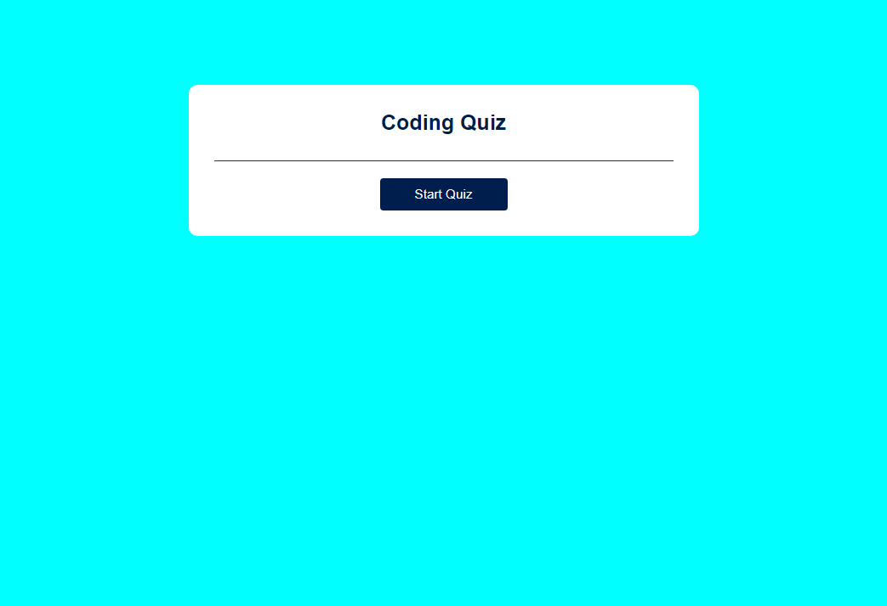

# Dylan's Javascript Coding-Quiz

## Table of Contents

- [Project Overview](#project-overview)
- [Built With](#built-with)
- [Features](#features)
- [Screenshots/Deploy](#screenshotsdeploy)
- [License](#license)

## Project Overview

I made this webpage to demonstrate my current level of knowledge with Javascript and to showcase my ability to build light applications. 

## Built With

- HTML
- CSS
- Javascript

## Features

- Click the Start Button to get started!
- When the quiz starts, the first question is displayed and the timer begins a countdown!
- Answer the question and move on to the next before you run out of time!
- Be careful! If you get a question incorrect, you lose time! 
- When all question are answer or the timer reaches 0, the quiz is over. 
- On the ending screen, you can save your score and initials to compare with friends. 

## Screenshots/Deploy

 [Coding-Quiz](https://github.com/DylanOzzy/Coding-Quiz)

 
 

## License

MIT License

Copyright (c) [2023] Dylan Osborn

Permission is hereby granted, free of charge, to any person obtaining a copy
of this software and associated documentation files (the "Software"), to deal
in the Software without restriction, including without limitation the rights
to use, copy, modify, merge, publish, distribute, sublicense, and/or sell
copies of the Software, and to permit persons to whom the Software is
furnished to do so, subject to the following conditions:

The above copyright notice and this permission notice shall be included in all
copies or substantial portions of the Software.

THE SOFTWARE IS PROVIDED "AS IS", WITHOUT WARRANTY OF ANY KIND, EXPRESS OR
IMPLIED, INCLUDING BUT NOT LIMITED TO THE WARRANTIES OF MERCHANTABILITY,
FITNESS FOR A PARTICULAR PURPOSE AND NONINFRINGEMENT. IN NO EVENT SHALL THE
AUTHORS OR COPYRIGHT HOLDERS BE LIABLE FOR ANY CLAIM, DAMAGES OR OTHER
LIABILITY, WHETHER IN AN ACTION OF CONTRACT, TORT OR OTHERWISE, ARISING FROM,
OUT OF OR IN CONNECTION WITH THE SOFTWARE OR THE USE OR OTHER DEALINGS IN THE
SOFTWARE.
